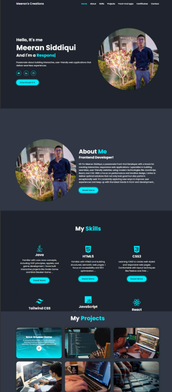

# 🚀 Self-Profile Clone



## 📌 Project Overview
This project is a **fully responsive and interactive** self-profile clone designed using **HTML, CSS, and JavaScript**. The objective is to create a **personalized and modern profile page** that showcases your skills, projects, and achievements, providing a seamless user experience.

## ✨ Features
✅ **Responsive Design** – Optimized for different devices  
✅ **Smooth Navigation** – Modern UI/UX with clean transitions  
✅ **Project Showcase** – Display of featured projects with details  
✅ **Contact Section** – Easy-to-access contact information  

## 🔧 Tech Stack
- **Frontend:** HTML, CSS, JavaScript  

## 🚀 Upcoming Features
🔹 **Dark Mode & Theme Customization**  
🔹 **Form Validation for Contact Section**  
🔹 **Dynamic Content Loading**  


## 📂 Installation & Usage
1. Clone this repository:  
   ```bash
   git clone https://github.com/M-Meeran-Siddiqui/meeran-profile-.git
   ```
2. Open `index.html` in your browser to view the project.
